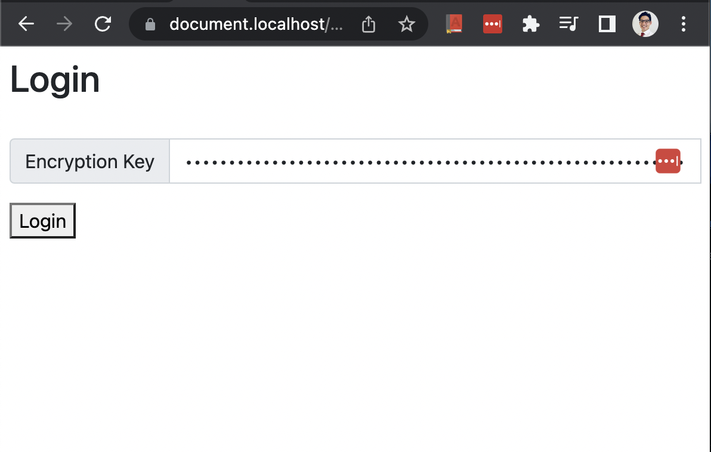
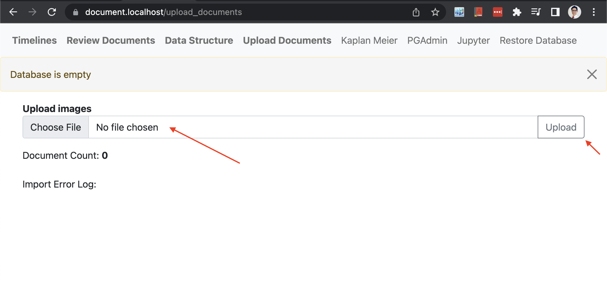
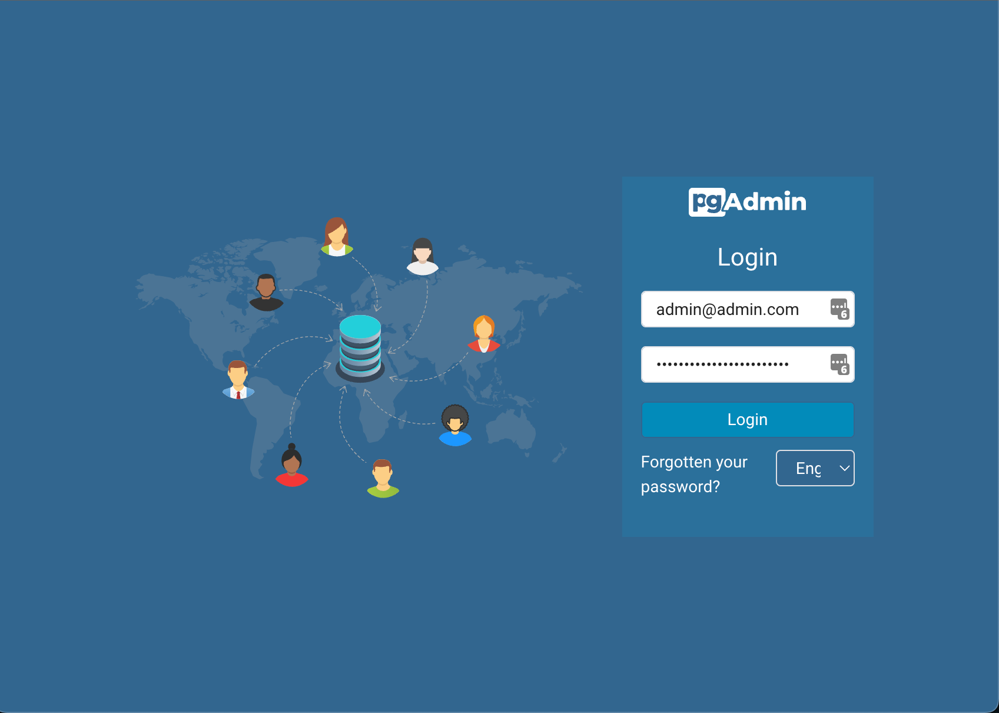
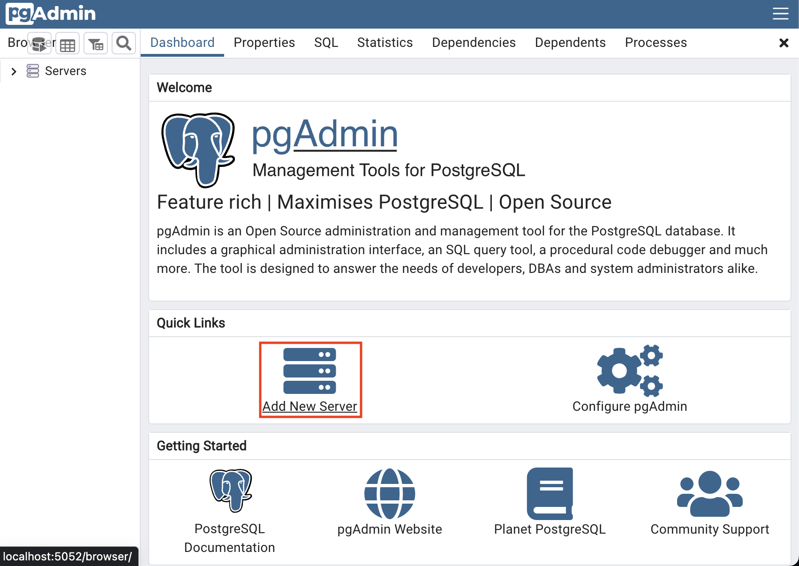
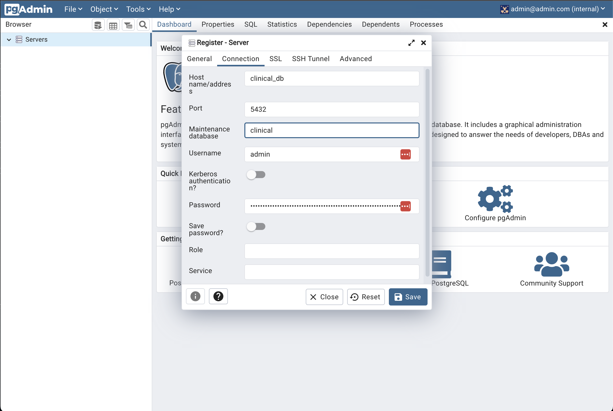
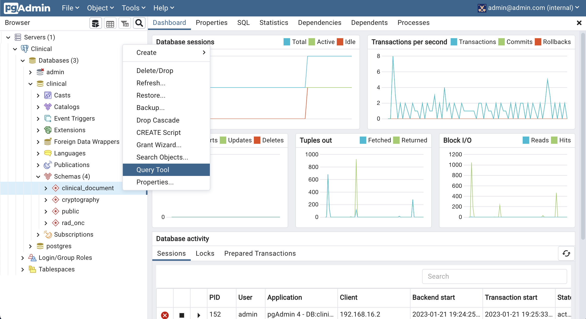
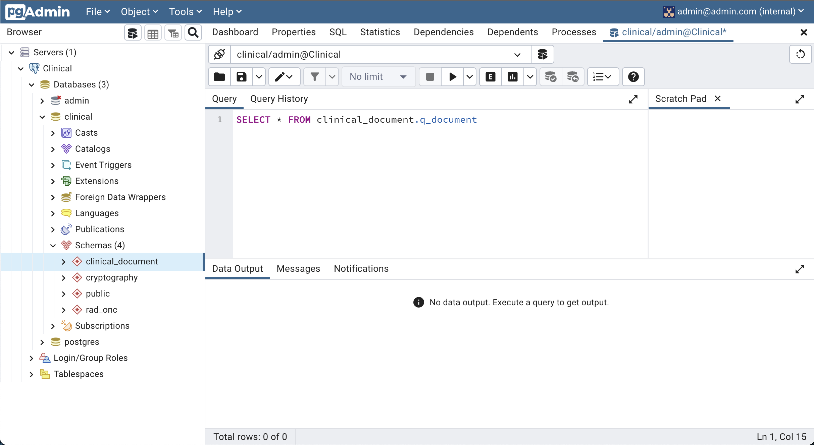
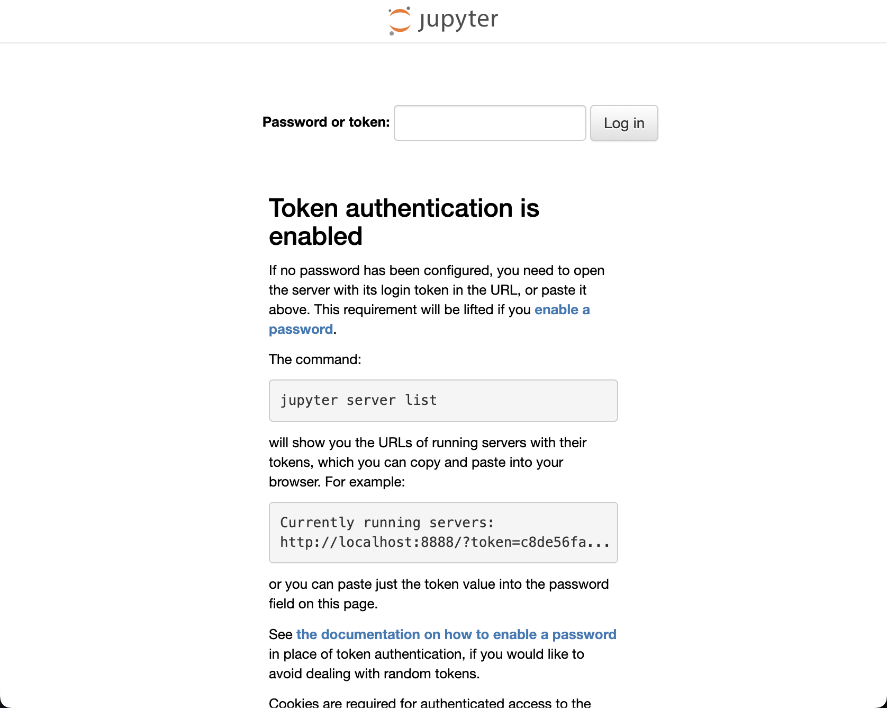

# Clinical Document

An annotation tool for clinical documents

# Summary
_____________________________

- [Install Dependencies](#install-dependencies)
- [Start Clinical Document](#start-clinical-document)
- [Accessing Clinical Document](#accessing-clinical-document)
- Components:
	- [PgAdmin](#pgadmin)
    - [Jupyter Notebook](#jupyter)

# Overview
Easily annotate clinical documents, and data aggrigation

### Aggrigate Databases
Individual local databases can easily be merged to create large data stores<br>


### Basic Clinical Data Annotation

https://user-images.githubusercontent.com/8246436/217722512-f6712c22-95f8-463f-9640-8dfca1444a63.mov

### Annotation
Annotate diagnosis specific attributes

https://user-images.githubusercontent.com/8246436/217724198-29af85e2-f9a1-40f0-8f23-de9ff47f287f.mp4


### Define Data Structures
Define custom data structures

https://user-images.githubusercontent.com/8246436/217726292-1ff3c2cd-85af-4f9d-ad5e-5c54aab876d7.mp4


### Timelines
View patient timelines

https://user-images.githubusercontent.com/8246436/217722587-38366c18-87e8-4980-a224-ef8445136d12.mov

### Kaplan Meier Curves
Easily generate kaplan meier cures

https://user-images.githubusercontent.com/8246436/217722643-6a481112-96f7-4d81-b1fd-6bc0429c4d05.mov

### Jupyter Notebook
Full access to analytics workbook including R-Statistics, Julia, and Python libraries

https://user-images.githubusercontent.com/8246436/217724325-3fae5ec0-1a82-4be5-9f0b-d77493f88fac.mp4


# Install Dependencies
### Install docker
Mac:<br>
[https://docs.docker.com/desktop/install/mac-install/](https://docs.docker.com/desktop/install/mac-install/)
<br>Linux:<br>
[https://docs.docker.com/desktop/install/linux-install/](https://docs.docker.com/desktop/install/linux-install/)
<br>Windows:<br>
[https://docs.docker.com/desktop/install/windows-install/](https://docs.docker.com/desktop/install/windows-install/)

### Install docker compose
Install docker-compose if not installed with docker (separate instillation in linux) <br>
Ref: [https://docs.docker.com/compose/install/](https://docs.docker.com/compose/install/)

### Install Git and OpenSSL 
Ref: [https://mac.install.guide/homebrew/index.html](https://mac.install.guide/homebrew/index.html)

Open Terminal.app:<br>
- Applications > Utilities > Terminal

Copy & Paste the following commands in the "Terminal" application<br>

``` 

# Install Homebrew
/bin/bash -c "$(curl -fsSL https://raw.githubusercontent.com/Homebrew/install/HEAD/install.sh)"
(echo; echo 'eval "$(/opt/homebrew/bin/brew shellenv)"') >> ~/.bash_profile
eval "$(/opt/homebrew/bin/brew shellenv)"
  
# Install OpenSSL
brew install openssl@1.1
brew link --force openssl@1.1
echo 'export PATH="/opt/homebrew/opt/openssl@1.1/bin:$PATH"' >> ~/.zshrc
source ~/.zshrc

# Install Git
brew install git

# Install wget
brew install wget
```
### Grant Priviliges

System Preference > Privacy & Security > Files & Folders <br>
Grant "Terminal" and "Docker" access

Most errors in installation are predmoniantly derived from permission errors. 


# Start Clinical Document
<span style="color:red">Initialization may take an additional 30 minutes, as it will need to install several components</span>.

start.command > Right Click > Open 


The computer's password is required to install dependencies, and for https. 
```commandline
The computer's password is required for OpenSSL Installation:
==> Checking for `sudo` access (which may request your password)...
Password:
...
```

A 256-bit encryption key is required to start the database. This is a 64 hexadecimal character string comprised of numbers and lowercase letters (a-f).<br>
<p>Save the encryption key as this cannot be restored, and is required to access the database</p>

```commandline
Randomly Generated (256-bit) Encryption Keys:
3ae85b65fec77544fc6d8ce901b1afeb5f033b7380a3f61b6690f6adaefeaaff
68fc768343dca7b19a9c50679386ae9a8d2243caf751866686a561d49455a80a
746aac782a070ad0d9bf9b2f58e51e4381450b5196641e60b7c8668023a121ac
eddbd0f75f74b6bb7380903dcdd7ffca75587db539609b4442d798d2b0076d26

Enter Encryption Key: (64 Hexadecimal; lower case letters [a-f] and numbers allowed):
```
<span style="color:red">Wait an additional 30 minutes. The program will download from docker hub https://hub.docker.com/repositories/andrewlimmer. </span>


# Accessing Clinical Document
Navigate to: 
```
https://document.localhost/
or
https://jupyter.localhost/
or
https://pgadmin.localhost/
```
================================================
# ClinicalDocument

### Login

Login using the encryption key.
<br>



Upload Documents



================================================
# PGAdmin
Explore the SQL PostgreSQL Database via PGAdmin
```
https://pgadmin.localhost/
```

### Login
Login using default email and password<br>
```
email: admin@admin.com
password: KQgiUJv1tG16A9hgxIhE32JcxdsANZU7eCi9om3Wlq1RUMnAnZrue
```



### Add Server <br />


### Server Attributes <br />
Server Name <br />

Server Address & Password <br>

```
host name: clinical_db 
Username: admin
Password:  <256-bit encryption key> 
```



### Query SQL
Right Click "clinical" > "Query Tool"

Write Query

Run to view result


# Jupyter
Explore the Jupyter via
```
https://jupyter.localhost/
```
Enter Default Token
```
token: <256-bit encryption key>
```

